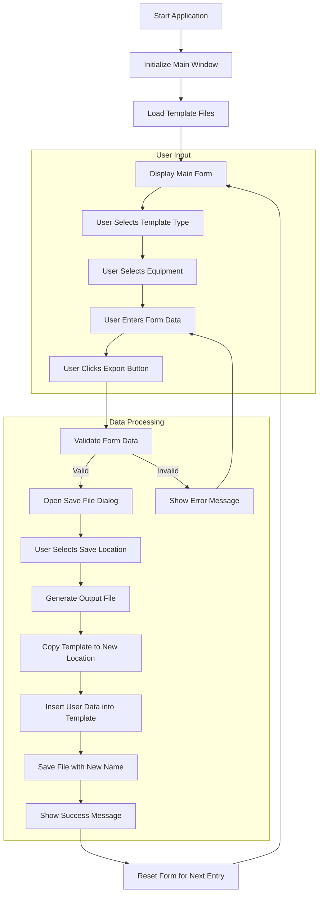

# Packing Template Generator - Process Flow

## Detailed Process Steps

### 1. Application Initialization
- Create main application window using Tkinter
- Set window title, size, and other properties
- Load required template files (ITP and Packing Slip)
- Initialize form fields with default values (e.g., current date)

### 2. User Interaction Flow
1. **Template Selection**
   - User selects between "ITP" and "Packing List" template types
   - Equipment dropdown updates based on selected template
   - For Packing List template, user can choose between sub-templates:
     - "72.5kV Disc Motorised + Dual E/S Motorised"
     - "33kV Disc Manual + Single E/S Manual"
   - More packing list sub-templates may be added in the future

2. **Equipment Selection**
   - User selects from available equipment options based on selected template type:
     - For ITP template:
       - "33kV Disc Manual + Single E/S Manual"
       - "72.5kV Disc Motorised + Dual E/S Motorised"
     - For Packing List template:
       - "72.5kV Disc Motorised + Dual E/S Motorised"
       - "33kV Disc Manual + Single E/S Manual"
   - Equipment options may vary depending on the selected template type

3. **Form Completion**
   - User enters/edits the following fields:
     - Customer (text input)
     - Purchase Order (text input)
     - Date (auto-filled, editable)
     - Drawing No. (text input)
     - Serial No. (text input)

### 3. Export Process
1. **Validation**
   - Check all required fields are filled
   - Validate data formats
   - Show error messages for any issues

2. **File Operations**
   - Open file save dialog for user to choose location
   - Create a copy of the selected template
   - Insert user data into specific cells (starting from row 3-8, column C)
   - Preserve all template formatting (cell sizes, colors, etc.)
   - Save the file with appropriate name

3. **User Feedback**
   - Show success message on successful export
   - Show error message if export fails
   - Option to open the exported file

### 4. Reset and Continue
- Clear or reset form fields
- Return to initial state for next entry
- Maintain template and equipment selection for workflow efficiency

## Error Handling
- Handle missing template files
- Validate file write permissions
- Catch and display file operation errors
- Provide clear error messages to guide the user

## Deployment Considerations
- Package as single executable for Windows
- Include all template files
- Ensure portability across different Windows machines
